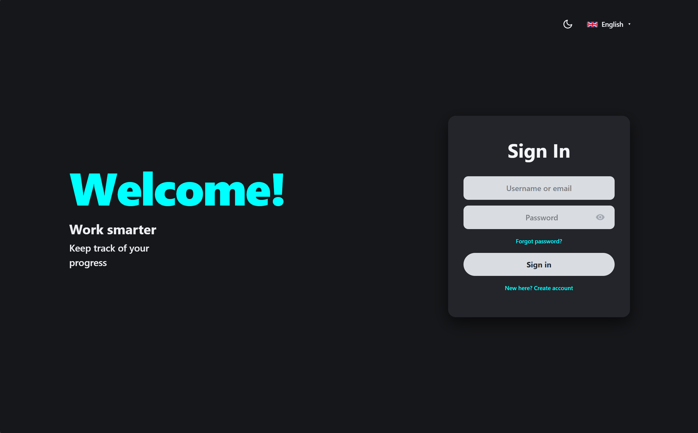
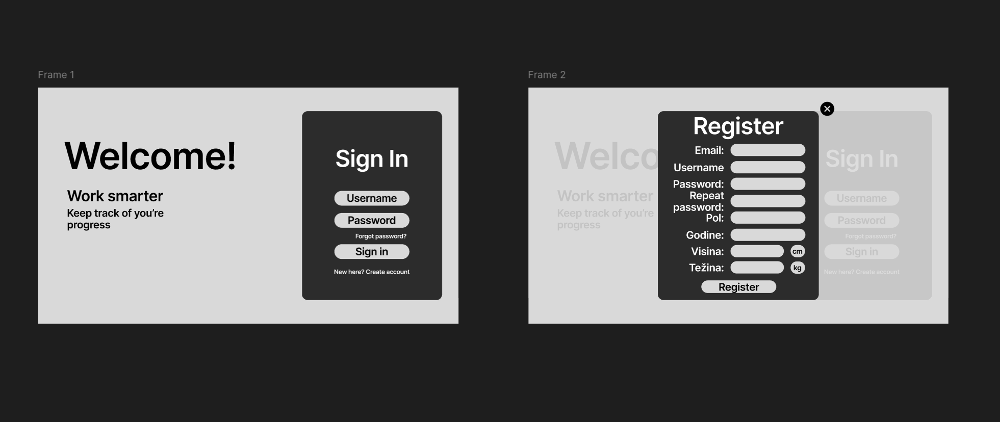

# WeDoSoftware task (Gym Workout Tracker)

Full-stack app for logging workouts and tracking progress: auth, workout logging with a computed intensity score, a calendar finder, and monthly statistics.

## Demo



## Design

The UI and app architecture were designed in Figma first, then implemented.

[](https://www.figma.com/proto/yQdGko15gSozZjsruG0yZm/WeDoSoftwarer_task?node-id=3-128&t=zmRos20XHpaas0DN-0&scaling=min-zoom&content-scaling=fixed&page-id=1%3A3216)

[Open in Figma](https://www.figma.com/proto/yQdGko15gSozZjsruG0yZm/WeDoSoftwarer_task?node-id=3-128&t=zmRos20XHpaas0DN-0&scaling=min-zoom&content-scaling=fixed&page-id=1%3A3216)

## Stack

- Backend: .NET 10, ASP.NET Core, Clean Architecture
- Database: PostgreSQL 17, EF Core 10
- Auth: ASP.NET Core Identity, JWT, refresh tokens
- Frontend: Angular 21 (standalone, signals, zoneless)
- i18n: ngx-translate (en, sr)
- Infra: Docker Compose
- Tests: xUnit, Vitest

## Run

```bash
docker compose up -d --build
```

App at http://localhost:4200, API at http://localhost:8080/swagger. Migrations and demo data seed automatically.

Demo users:

| Username | Password |
|---|---|
| `ana`  | `Ana12345!` |
